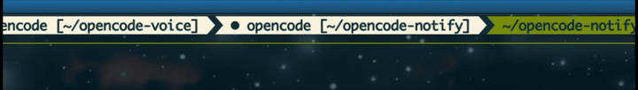
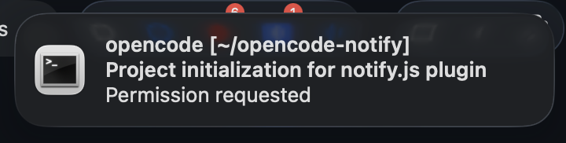

[](https://github.com/renjfk/opencode-notify/actions/workflows/ci.yml)
[](LICENSE)
[](https://www.npmjs.com/package/@renjfk/opencode-notify)
[](https://www.npmjs.com/package/@renjfk/opencode-notify)

# opencode-notify

Attention notifications plugin for [OpenCode](https://opencode.ai/).

Blinks the Zellij tab, plays a sound, and posts a macOS desktop notification
when a session needs your attention (idle after work, permission request,
question asked). The plugin adapts to whether your terminal window is visible
and whether the Zellij tab is active, so you only get pinged when you would
actually miss the event.

|                 Zellij tab blinking                  |                     Desktop notification                      |
| :--------------------------------------------------: | :-----------------------------------------------------------: |
|  |  |

## Behavior

When OpenCode needs attention:

| Tab active | Ghostty visible | Screen locked | Action                                              |
| ---------- | --------------- | ------------- | --------------------------------------------------- |
| Yes        | Yes             | No            | Do nothing (user can see it)                        |
| Yes        | No              | No            | Desktop notification                                |
| No         | Yes             | No            | Blink tab + sound                                   |
| No         | No              | No            | Blink tab + desktop notification                    |
| Any        | Any             | Yes           | ntfy push + blink tab when inactive (if configured) |

When the screen is locked, the terminal counts as not visible (macOS still
reports Ghostty windows while the screen saver covers them), so without ntfy
a desktop notification is still queued and shown when you unlock. With ntfy
configured, the push replaces the desktop notification unless
`"desktop": "keep"` is set.

Pushes are not tied to lock detection alone: a runtime toggle in the
command palette (`Push notifications: automatic / always on / off`) overrides
it, see [Push notifications via ntfy](#push-notifications-via-ntfy-optional).

The tab blinking stops when:

- You switch to the tab (detected via polling)
- OpenCode goes busy again (you responded)

## Install

Add to your `tui.json` (create at `~/.config/opencode/tui.json` if it doesn't exist):

```json
{
  "$schema": "https://opencode.ai/tui.json",
  "plugin": ["@renjfk/opencode-notify"]
}
```

### Refresh cached plugin after updates

If OpenCode keeps using an older published version of the plugin after an
update, clear the cached package and restart OpenCode:

```bash
rm -rf ~/.cache/opencode/packages/@renjfk/
```

## Prerequisites

All integrations are **optional** and probed independently at startup. The
plugin degrades gracefully: anything missing is skipped, and a warning toast is
shown so you know what was disabled.

| Dependency                                                                 | Enables                                                 | Without it                                                            |
| -------------------------------------------------------------------------- | ------------------------------------------------------- | --------------------------------------------------------------------- |
| [Zellij](https://zellij.dev/) (`zellij`) + running inside a Zellij pane    | Tab blinking when OpenCode needs attention              | Tab blinking is skipped; desktop notifications and sound still work   |
| macOS + [Ghostty](https://ghostty.org/)                                    | Window-visibility aware behavior (no spam when visible) | Ghostty is treated as "not visible"; falls back to always notifying   |
| [terminal-notifier](https://github.com/julienXX/terminal-notifier) + macOS | Desktop notifications                                   | Desktop notifications are skipped                                     |
| macOS (`afplay`)                                                           | Attention sound                                         | Sound is skipped                                                      |
| macOS (screen-lock state via IORegistry)                                   | Screen-lock detection for automatic ntfy pushes         | Use the always-on toggle for pushes; desktop notifications still work |
| [ntfy](https://ntfy.sh) topic (optional config)                            | Push notifications while the screen is locked           | Skipped silently; everything else works as before                     |

### Recommended setup (full experience)

For the behavior matrix above to work end-to-end, install all of the following
on macOS:

```bash
brew install zellij terminal-notifier
```

Use [Ghostty](https://ghostty.org/) as your terminal and run OpenCode inside a
Zellij session. This gives you:

- **Tab blinking** so you can spot attention events at a glance across panes
- **Audible cue** when Ghostty is visible but the OpenCode tab is in the background
- **Desktop notifications** when Ghostty is hidden, so you get pinged even when
  you've tabbed away
- **Silence** when the tab is active and Ghostty is visible - the plugin stays
  out of your way when you can already see what's happening

If you don't use Zellij, Ghostty, or macOS, the plugin still does something
useful: it falls back to desktop notifications and/or sound wherever those are
available, and no-ops otherwise.

### Recommended: meaningful Zellij tab names (fish shell)

By default Zellij names tabs `Tab #1`, `Tab #2`, etc. The plugin's blinking is
easier to parse when each tab shows the current directory or command instead.
If you use [fish](https://fishshell.com/), drop [`contrib/zellij.fish`](contrib/zellij.fish)
into `~/.config/fish/conf.d/` to get:

- Tab renamed to the shortened `$PWD` on shell start and on every `cd`
- Tab renamed to the running command while it executes, then back to the
  directory when it completes
- Targeted per-tab updates using `--tab-id` so background tabs don't get
  clobbered by foreground activity

```bash
curl -L https://raw.githubusercontent.com/renjfk/opencode-notify/main/contrib/zellij.fish \
  -o ~/.config/fish/conf.d/zellij.fish
```

Requires Zellij 0.44.0+ (for `rename-tab --tab-id`) and [`jq`](https://jqlang.org/).

## Push notifications via ntfy (optional)

When the screen is locked, the plugin can push the attention event to your
phone via [ntfy](https://ntfy.sh) - install the
[Android](https://play.google.com/store/apps/details?id=io.heckel.ntfy) or
[iOS](https://apps.apple.com/us/app/ntfy/id1625396347) app and subscribe to
your topic. Works with the public ntfy.sh server and self-hosted instances,
with or without authentication.

Enable it by passing plugin options in `tui.json`:

```json
{
  "$schema": "https://opencode.ai/tui.json",
  "plugin": [
    ["@renjfk/opencode-notify", { "ntfy": { "topic": "opencode-notify-YOUR-RANDOM-SUFFIX" } }]
  ]
}
```

### Options

| Option            | Default           | Description                                                                                   |
| ----------------- | ----------------- | --------------------------------------------------------------------------------------------- |
| `topic`           | (required)        | ntfy topic name, up to 64 chars of `A-Z a-z 0-9 - _`                                          |
| `server`          | `https://ntfy.sh` | Any ntfy server URL, e.g. a self-hosted instance                                              |
| `tokenEnv`        | (none)            | Name of an environment variable holding the access token (`tk_...`), sent as Bearer           |
| `actionsTokenEnv` | (none)            | Separate token embedded in action buttons (see Security notes)                                |
| `priority`        | per-event default | Overrides the ntfy priority (`high` for permission/question, `default` otherwise)             |
| `desktop`         | `skip`            | `keep` also posts the desktop notification while locked (queued by macOS until unlock)        |
| `replies`         | `true`            | `false` disables answering questions and permissions from the phone                           |
| `detail`          | `full`            | `minimal` keeps pushes generic (like desktop notifications) and turns replies off             |
| `maxMessageBytes` | `3800`            | Byte cap for push bodies; raise it for self-hosted servers with a higher `message_size_limit` |

The token is read from the environment, never stored in `tui.json` - load it
from your secret manager of choice before starting opencode (e.g.
`OPENCODE_NOTIFY_TOKEN=$(rbw get ...) opencode`).

Example for a self-hosted instance with access-token auth:

```json
{
  "$schema": "https://opencode.ai/tui.json",
  "plugin": [
    [
      "@renjfk/opencode-notify",
      {
        "ntfy": {
          "server": "https://ntfy.example.com",
          "topic": "opencode-notify",
          "tokenEnv": "OPENCODE_NOTIFY_TOKEN",
          "desktop": "keep"
        }
      }
    ]
  ]
}
```

The server is probed at startup; if it is unreachable or the credentials are
rejected, a warning toast is shown and the push is skipped (everything else
keeps working).

### Answering from your phone

With replies enabled (the default), a pushed question or permission prompt
includes its content - the last assistant message for context, the question
with numbered options (multi-question forms are numbered `Q1`, `Q2`, ...),
or the permission name and patterns - plus a one-line hint. You answer with
the notification's action buttons, or by tapping it: the tap opens the
reply topic's web view in a browser, which has a publish box for typed
replies. The plugin forwards your answer to OpenCode and posts a
confirmation back to the topic.

Replies are routed through a per-instance reply topic (your configured
topic plus a random suffix generated at startup), so several opencode
processes can share one base topic without ever consuming each other's
pushes or answers. Only the base topic needs to be subscribed to on the
phone; buttons and taps address the right instance automatically.

The reply protocol:

| Reply                                    | Effect                                             |
| ---------------------------------------- | -------------------------------------------------- |
| `yes` / `y` / `once` / `ok` / `allow`    | Permission: approve once                           |
| `always` / `a` / `forever`               | Permission: approve and remember for the session   |
| `no` / `n` / `reject` / `deny`           | Permission: reject (`no: reason` adds feedback)    |
| `2`                                      | Question: pick option 2                            |
| `Postgres`                               | Question: pick by option label                     |
| `use Redis`                              | Question: custom answer (when the question allows) |
| `1+3`                                    | Question: multi-select options 1 and 3             |
| `1,2`                                    | Form: answer Q1 with option 1, Q2 with option 2    |
| `1,skip`                                 | Form: answer Q1, leave Q2 unanswered               |
| `skip` / `reject` / `cancel` / `dismiss` | Question: dismiss the request                      |

A typed reply applies to the most recently pushed pending request, and
pending requests expire after 10 minutes. Requests answered at the desktop
are dropped from the channel; a late phone reply then gets a "no pending
request" note instead.

Permission pushes and simple questions (single-select; the first three
options) also carry action buttons that post the reply when tapped - no
typing needed. Each button is bound to the request it was built for: tapping
it always answers that request, never a newer one (tapping the button of an
already-answered request gets an explicit notice). Action buttons show up
in the Android and web apps. The mobile apps cannot publish messages, so
anything that needs typing (multi-select, forms, custom text) is answered
from the reply topic's web view (tap the notification) or at the terminal.

Task-completed pushes carry the agent's last message, so you can see what
finished without opening the terminal.

If you would rather not put session content on the topic, set
`"detail": "minimal"`: pushes stay generic (exactly like the desktop
notifications: session title + event message) and the reply channel is off.

### Push modes and the runtime toggle

Lock detection is only one trigger. Once ntfy is configured, three commands
appear in the command palette (category "Notify") and can be switched at any
time; the choice is persisted and survives restarts:

| Command                         | Behavior                                                          |
| ------------------------------- | ----------------------------------------------------------------- |
| `Push notifications: automatic` | Push when the screen is locked (default)                          |
| `Push notifications: always on` | Push whenever the terminal is not visible or the screen is locked |
| `Push notifications: off`       | Never push                                                        |

`always on` is the escape hatch for the limits of lock detection: it covers
stepping away without locking, displays that sleep without locking, and
platforms where lock detection is unavailable (e.g. Linux). The push is a
drop-in replacement for the desktop notification: while the terminal is
visible you get the normal in-terminal signals (nothing on the active tab,
blink + sound on a background tab) and no push; when the terminal is not
visible, or the screen is locked, the push takes the desktop notification's
place (unless `"desktop": "keep"`).

### Security notes

- On the public ntfy.sh server, **the topic name is the only secret**. Anyone
  who knows it can read your notifications. Pick a long random suffix (the
  [ntfy docs](https://docs.ntfy.sh/publish/#picking-a-topic) have a generator).
  Pushes include the session title, and with replies enabled also the last
  assistant message and the question or permission content; use
  `"detail": "minimal"` to keep them generic, or keep the full detail for
  self-hosted servers.
- With replies enabled, **anyone who can publish to your topics can answer
  your questions and approve your permissions**. On ntfy.sh that means
  anyone who knows the base topic name; on self-hosted servers restrict
  write access with access control so only your account/token can publish.
  Set `"replies": false` to turn the channel off.
- With `tokenEnv` auth, action buttons must embed credentials so a tap can
  publish your reply - and every subscriber can read them. By default that
  is your publishing token. If your subscribers are not all you, set
  `actionsTokenEnv` to a token from a dedicated **write-only** user (e.g.
  `ntfy user add opencode-actions && ntfy access opencode-actions
"opencode-notify*" wo`): a leaked actions token can then only publish
  replies, not read your notifications or publish to anything else.
- For stronger guarantees, self-host ntfy with
  [`auth-default-access: deny-all`](https://docs.ntfy.sh/config/#access-control)
  and use `tokenEnv` auth. Then only holders of the token can read or write
  the topics; the topic name no longer needs to be unguessable.
- Note that pushing through ntfy.sh (or any relay) means the message transits
  that server and, for app delivery, Google's/Apple's push infrastructure.
- Screen-lock detection on macOS reads the session's lock state from the
  IORegistry (`CGSSessionScreenIsLocked`, the same source CoreGraphics
  exposes), which works on modern macOS including 26. Displays that sleep
  without locking are not detected. On other platforms lock detection is
  unavailable; switch to `always on` via the command palette to get pushes
  there (a warning toast points this out if you configure ntfy on such a
  system).

## How it works

1. On every attention event (`session.idle` after busy, `permission.asked`,
   `question.asked`), the plugin checks:
   - Is the Zellij tab hosting OpenCode active?
   - Is a Ghostty window visible on screen?
   - Is the screen locked (macOS)?
2. If the tab is inactive, the plugin renames it to blink between `●` and `○`
   prefixes until the tab becomes active again or the session goes busy.
   Renames are serialized so a stop always restores the original name last,
   and any leftover marker from a previous cycle (e.g. OpenCode exited while
   blinking) is stripped before a new one starts, so dots never stack up.
3. If Ghostty is not visible, a `terminal-notifier` message is posted with the
   tab name as the title and the session title as the subtitle.
4. If Ghostty is visible but the tab is inactive, only an audible cue (Blow
   system sound) is played - no desktop notification.
5. If the user is away - screen locked (automatic mode) or push
   notifications set to always on - and ntfy is configured, a push is sent to
   the configured topic with the session title, the event message, a priority
   (`high` for permission/question, `default` otherwise), and a fitting emoji
   tag. With replies enabled, questions and permissions instead carry their
   full content plus the last assistant message (rendered as Markdown) and
   action buttons, and the topic is polled for answers while a request is
   pending; completed tasks carry the agent's last message. While away the
   terminal counts as not visible, so without ntfy a desktop notification is
   queued for unlock instead.

Notifications are debounced to 2 seconds to avoid duplicates.

## Contributing

opencode-notify is open to contributions and ideas!

### Issue conventions

**Format:** `type: brief description`

- `feat:` new features or functionality
- `fix:` bug fixes
- `enhance:` improvements to existing features
- `chore:` maintenance tasks, dependencies, cleanup
- `docs:` documentation updates
- `build:` build system, CI/CD changes

### Development

```bash
npm run check        # test + lint + fmt
npm test             # node:test unit tests
npm run lint         # oxlint
npm run fmt          # oxfmt --check
npm run fmt:fix      # oxfmt --write
```

### Release process

Manual releases via opencode; see [RELEASE_PROCESS.md](RELEASE_PROCESS.md).

## License

This project is licensed under the [MIT License](LICENSE).
